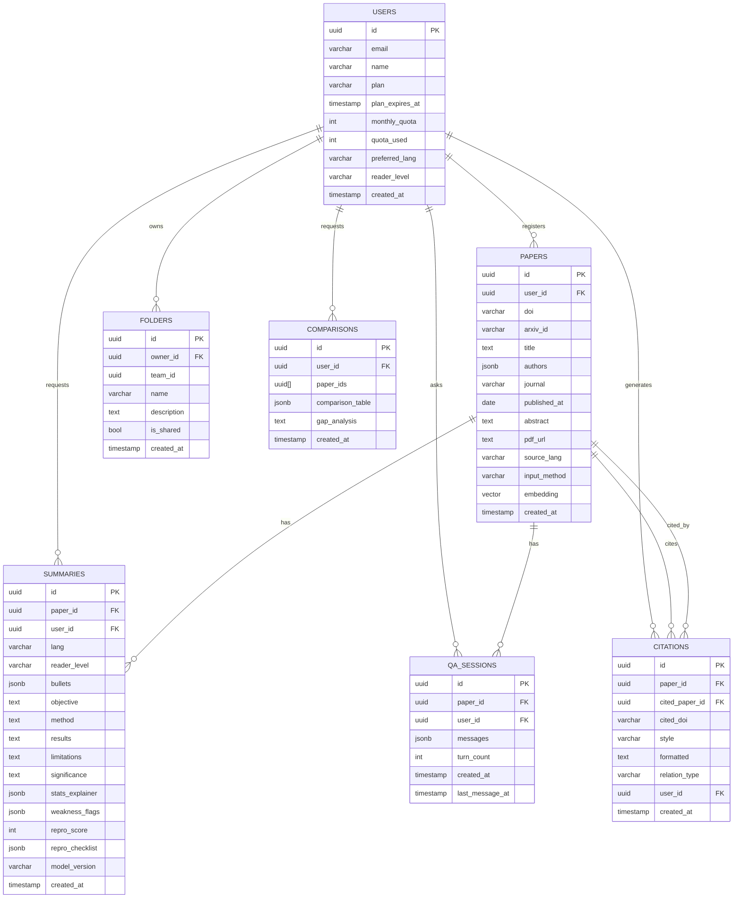

# Paper ERD

Mermaid `erDiagram`은 속성·관계 라벨의 **따옴표·괄호·슬래시** 등에서 파싱 오류가 납니다. 필드 설명은 아래 표를 참고하세요.

## 관계

| 관계 | 설명 |
| ---- | ---- |
| USERS → PAPERS | 1:N, 논문 등록 (`user_id` → `USERS.id`) |
| USERS → FOLDERS | 1:N, 폴더 소유 (`owner_id` → `USERS.id`) |
| USERS → SUMMARIES | 1:N, 요약 요청 (`user_id` → `USERS.id`) |
| PAPERS → SUMMARIES | 1:N, 논문 요약 결과 (`paper_id` → `PAPERS.id`) |
| USERS → QA_SESSIONS | 1:N, 질문 세션 생성 (`user_id` → `USERS.id`) |
| PAPERS → QA_SESSIONS | 1:N, 논문별 대화 세션 (`paper_id` → `PAPERS.id`) |
| PAPERS → CITATIONS | 1:N, 인용하는 논문 (`paper_id` → `PAPERS.id`) |
| PAPERS → CITATIONS | 1:N, 인용되는 논문 (`cited_paper_id` → `PAPERS.id`, nullable) |
| USERS → CITATIONS | 1:N, 인용 생성 요청 (`user_id` → `USERS.id`) |
| USERS → COMPARISONS | 1:N, 비교 분석 요청 (`user_id` → `USERS.id`) |
| COMPARISONS.paper_ids | PAPERS.id 배열 참조 (uuid[], M:N — 별도 junction 없이 배열로 관리) |
| FOLDERS.team_id | teams.id 참조 (nullable, 개인 폴더면 null) |

## 필드 설명

| 엔티티         | 필드               | 설명                                                           |
| ----------- | ---------------- | ------------------------------------------------------------ |
| USERS       | id               | 사용자 고유 ID (PK)                                               |
| USERS       | email            | 로그인 이메일 (IDX)                                                |
| USERS       | name             | 표시 이름                                                        |
| USERS       | plan             | 구독 플랜 (free / pro / team)                                    |
| USERS       | plan_expires_at  | 플랜 만료일                                                       |
| USERS       | monthly_quota    | 월 요약 허용 건수                                                   |
| USERS       | quota_used       | 이번 달 사용 건수                                                   |
| USERS       | preferred_lang   | 선호 언어 (ko, en, ja …)                                         |
| USERS       | reader_level     | 독자 수준 (beginner / undergrad / expert)                        |
| USERS       | created_at       | 가입일                                                          |
| PAPERS      | id               | 논문 고유 ID (PK)                                                |
| PAPERS      | user_id          | USERS.id 참조 (FK)                                             |
| PAPERS      | doi              | DOI 식별자 (IDX)                                                |
| PAPERS      | arxiv_id         | arXiv ID (IDX)                                               |
| PAPERS      | title            | 논문 제목                                                        |
| PAPERS      | authors          | 저자 목록 [{name, affiliation}, …] (jsonb)                       |
| PAPERS      | journal          | 게재 저널명                                                       |
| PAPERS      | published_at     | 발행일                                                          |
| PAPERS      | abstract         | 원문 초록                                                        |
| PAPERS      | pdf_url          | 원본 PDF 저장 경로 (S3 등)                                          |
| PAPERS      | source_lang      | 원문 언어 코드                                                     |
| PAPERS      | input_method     | 등록 경로 (upload / doi / arxiv / scan / rss / clip)             |
| PAPERS      | embedding        | 의미 검색용 벡터 — pgvector (IDX)                                   |
| PAPERS      | created_at       | 등록일                                                          |
| FOLDERS     | id               | 폴더 ID (PK)                                                   |
| FOLDERS     | owner_id         | USERS.id 참조 (FK)                                             |
| FOLDERS     | team_id          | teams.id 참조 (FK, nullable — 개인 폴더면 null)                     |
| FOLDERS     | name             | 폴더 이름                                                        |
| FOLDERS     | description      | 폴더 설명                                                        |
| FOLDERS     | is_shared        | 팀 공유 여부                                                      |
| FOLDERS     | created_at       | 생성일                                                          |
| SUMMARIES   | id               | 요약 고유 ID (PK)                                                |
| SUMMARIES   | paper_id         | PAPERS.id 참조 (FK)                                            |
| SUMMARIES   | user_id          | USERS.id 참조 — 요청자 (FK)                                       |
| SUMMARIES   | lang             | 요약 언어                                                        |
| SUMMARIES   | reader_level     | 독자 수준 (beginner / undergrad / expert)                        |
| SUMMARIES   | bullets          | 5줄 요약 배열 (jsonb)                                             |
| SUMMARIES   | objective        | 연구 목적                                                        |
| SUMMARIES   | method           | 방법론 요약                                                       |
| SUMMARIES   | results          | 주요 결과                                                        |
| SUMMARIES   | limitations      | 한계점                                                          |
| SUMMARIES   | significance     | 연구 의의                                                        |
| SUMMARIES   | stats_explainer  | 통계 용어 해설 [{term, plain_text}] (jsonb)                        |
| SUMMARIES   | weakness_flags   | 방법론 약점 플래그 배열 (jsonb)                                        |
| SUMMARIES   | repro_score      | 재현 가능성 점수 0~100                                              |
| SUMMARIES   | repro_checklist  | 재현성 체크리스트 결과 (jsonb)                                         |
| SUMMARIES   | model_version    | 사용한 AI 모델 버전                                                 |
| SUMMARIES   | created_at       | 생성일                                                          |
| QA_SESSIONS | id               | 세션 ID (PK)                                                   |
| QA_SESSIONS | paper_id         | PAPERS.id 참조 (FK)                                            |
| QA_SESSIONS | user_id          | USERS.id 참조 (FK)                                             |
| QA_SESSIONS | messages         | 대화 메시지 배열 [{role, content, source_page, created_at}] (jsonb) |
| QA_SESSIONS | turn_count       | 총 대화 턴 수                                                     |
| QA_SESSIONS | created_at       | 세션 시작일                                                       |
| QA_SESSIONS | last_message_at  | 마지막 메시지 시각                                                   |
| CITATIONS   | id               | 인용 레코드 ID (PK)                                               |
| CITATIONS   | paper_id         | PAPERS.id 참조 — 인용하는 논문 (FK)                                  |
| CITATIONS   | cited_paper_id   | PAPERS.id 참조 — 인용되는 논문 (FK, nullable — DB 미등록 논문)            |
| CITATIONS   | cited_doi        | 외부 DOI — DB 미등록 논문용                                          |
| CITATIONS   | style            | 인용 스타일 (apa / mia / bibtex / chicago)                        |
| CITATIONS   | formatted        | 포맷된 인용 문자열                                                   |
| CITATIONS   | relation_type    | 관계 방향 (reference / cited_by)                                 |
| CITATIONS   | user_id          | USERS.id 참조 — 생성 요청자 (FK)                                    |
| CITATIONS   | created_at       | 생성일                                                          |
| COMPARISONS | id               | 비교 분석 ID (PK)                                                |
| COMPARISONS | user_id          | USERS.id 참조 (FK)                                             |
| COMPARISONS | paper_ids        | 비교 대상 논문 ID 배열 (uuid[])                                      |
| COMPARISONS | comparison_table | 항목별 비교 결과 [{dimension, values[]}] (jsonb)                    |
| COMPARISONS | gap_analysis     | 연구 갭 분석 텍스트                                                  |
| COMPARISONS | created_at       | 생성일                                                          |
