# 전체 DB 스키마 ERD

## ERD 다이어그램

```mermaid
erDiagram
  users {
    uuid id PK
    varchar email
    varchar name
    varchar preferred_lang
    enum reader_level
    timestamp created_at
  }
  plans {
    varchar plan_type PK
    int monthly_quota
    int price
  }
  user_plans {
    uuid id PK
    uuid user_id FK
    varchar plan_type FK
    timestamp started_at
    timestamp expires_at
  }
  quota_usage {
    uuid id PK
    uuid user_id FK
    int year_month
    int quota_used
  }
  teams {
    uuid id PK
    varchar name
    timestamp created_at
  }
  team_members {
    uuid team_id FK
    uuid user_id FK
    enum role
    timestamp joined_at
  }
  papers {
    uuid id PK
    varchar doi
    varchar arxiv_id
    text title
    varchar journal
    date published_at
    text abstract
    text pdf_url
    varchar source_lang
    enum input_method
    vector embedding
    timestamp created_at
  }
  authors {
    uuid id PK
    varchar name
    varchar affiliation
  }
  paper_authors {
    uuid paper_id FK
    uuid author_id FK
    int author_order
  }
  user_papers {
    uuid id PK
    uuid user_id FK
    uuid paper_id FK
    timestamp saved_at
    text memo
    int read_progress
  }
  folders {
    uuid id PK
    uuid owner_id FK
    uuid team_id FK
    varchar name
    text description
    bool is_shared
    timestamp created_at
  }
  folder_papers {
    uuid folder_id FK
    uuid paper_id FK
    uuid added_by FK
    timestamp added_at
  }
  folder_paper_votes {
    uuid folder_id FK
    uuid paper_id FK
    uuid user_id FK
    timestamp voted_at
  }
  comparisons {
    uuid id PK
    uuid user_id FK
    text gap_analysis
    timestamp created_at
  }
  comparison_papers {
    uuid comparison_id FK
    uuid paper_id FK
    int paper_order
  }
  comparison_rows {
    uuid id PK
    uuid comparison_id FK
    varchar dimension
    uuid paper_id FK
    text value
  }
  summaries {
    uuid id PK
    uuid paper_id FK
    uuid user_id FK
    varchar lang
    enum reader_level
    varchar model_version
    timestamp created_at
  }
  summary_content {
    uuid summary_id PK
    text objective
    text method
    text results
    text limitations
    text significance
    jsonb bullets
  }
  summary_analysis {
    uuid summary_id PK
    jsonb stats_explainer
    jsonb weakness_flags
    int repro_score
    jsonb repro_checklist
  }
  qa_sessions {
    uuid id PK
    uuid paper_id FK
    uuid user_id FK
    int turn_count
    timestamp created_at
    timestamp last_message_at
  }
  qa_messages {
    uuid id PK
    uuid session_id FK
    enum role
    text content
    int source_page
    timestamp created_at
  }
  citations {
    uuid id PK
    uuid paper_id FK
    uuid cited_paper_id FK
    varchar cited_doi
    enum relation_type
    timestamp created_at
  }
  citation_formats {
    uuid id PK
    uuid citation_id FK
    enum style
    text formatted
    uuid user_id FK
    timestamp created_at
  }

  users ||--o{ user_plans : "구독"
  plans ||--o{ user_plans : "플랜"
  users ||--o{ quota_usage : "사용량"
  users ||--o{ team_members : "소속"
  teams ||--o{ team_members : "구성원"
  teams ||--o{ folders : "팀폴더"
  users ||--o{ folders : "소유"
  users ||--o{ user_papers : "저장"
  papers ||--o{ user_papers : "저장됨"
  papers ||--o{ paper_authors : "집필"
  authors ||--o{ paper_authors : "참여"
  folders ||--o{ folder_papers : "포함"
  papers ||--o{ folder_papers : "폴더에"
  users ||--o{ folder_papers : "추가"
  folder_papers ||--o{ folder_paper_votes : "투표대상"
  users ||--o{ folder_paper_votes : "투표"
  users ||--o{ comparisons : "비교요청"
  comparisons ||--o{ comparison_papers : "대상논문"
  papers ||--o{ comparison_papers : "비교됨"
  comparisons ||--o{ comparison_rows : "결과행"
  papers ||--o{ comparison_rows : "값"
  papers ||--o{ summaries : "요약대상"
  users ||--o{ summaries : "요약요청"
  summaries ||--|| summary_content : "본문"
  summaries ||--|| summary_analysis : "분석"
  papers ||--o{ qa_sessions : "대화대상"
  users ||--o{ qa_sessions : "대화요청"
  qa_sessions ||--o{ qa_messages : "메시지"
  papers ||--o{ citations : "인용하는"
  papers ||--o{ citations : "인용되는"
  citations ||--o{ citation_formats : "포맷"
  users ||--o{ citation_formats : "생성요청"
```

---

## 👤 사용자 그룹

### `users` — 사용자 계정

| 컬럼               | 타입        | 설명                            |
| ---------------- | --------- | ----------------------------- |
| `id`             | uuid      | PK                            |
| `email`          | varchar   | 로그인 이메일                       |
| `name`           | varchar   | 표시 이름                         |
| `preferred_lang` | varchar   | 선호 언어 (ko, en, ja …)          |
| `reader_level`   | enum      | beginner / undergrad / expert |
| `created_at`     | timestamp | 가입일                           |

### `plans` — 플랜 정의

| 컬럼 | 타입 | 설명 |
|------|------|------|
| `plan_type` | varchar | PK — free / pro / team |
| `monthly_quota` | int | 월 요약 허용 건수 |
| `price` | int | 월 요금 |

### `user_plans` — 구독 이력

| 컬럼           | 타입        | 설명         |
| ------------ | --------- | ---------- |
| `id`         | uuid      | PK         |
| `user_id`    | uuid      | FK → users |
| `plan_type`  | varchar   | FK → plans |
| `started_at` | timestamp | 구독 시작일     |
| `expires_at` | timestamp | 플랜 만료일     |

### `quota_usage` — 월별 사용량

| 컬럼           | 타입   | 설명             |
| ------------ | ---- | -------------- |
| `id`         | uuid | PK             |
| `user_id`    | uuid | FK → users     |
| `year_month` | int  | 연월 (예: 202506) |
| `quota_used` | int  | 이번 달 사용 건수     |

### `teams` — 팀

| 컬럼           | 타입        | 설명   |     |
| ------------ | --------- | ---- | --- |
| `id`         | uuid      | PK   |     |
| `name`       | varchar   | 팀 이름 |     |
| `created_at` | timestamp | 생성일  |     |

### `team_members` — 팀↔사용자 M:N

| 컬럼 | 타입 | 설명 |
|------|------|------|
| `team_id` | uuid | FK → teams |
| `user_id` | uuid | FK → users |
| `role` | enum | admin / member |
| `joined_at` | timestamp | 가입일 |

---

## 📄 논문 그룹

### `papers` — 논문 메타데이터

| 컬럼             | 타입        | 설명                                       |
| -------------- | --------- | ---------------------------------------- |
| `id`           | uuid      | PK                                       |
| `doi`          | varchar   | DOI 식별자                                  |
| `arxiv_id`     | varchar   | arXiv ID                                 |
| `title`        | text      | 논문 제목                                    |
| `journal`      | varchar   | 게재 저널명                                   |
| `published_at` | date      | 발행일                                      |
| `abstract`     | text      | 원문 초록                                    |
| `pdf_url`      | text      | 원본 PDF 저장 경로                             |
| `source_lang`  | varchar   | 원문 언어 코드                                 |
| `input_method` | enum      | upload / doi / arxiv / scan / rss / clip |
| `embedding`    | vector    | 의미 검색용 벡터 (pgvector)                     |
| `created_at`   | timestamp | 등록일                                      |

### `authors` — 저자 마스터

| 컬럼            | 타입      | 설명    |
| ------------- | ------- | ----- |
| `id`          | uuid    | PK    |
| `name`        | varchar | 저자명   |
| `affiliation` | varchar | 소속 기관 |

### `paper_authors` — 논문↔저자 M:N

| 컬럼             | 타입   | 설명           |
| -------------- | ---- | ------------ |
| `paper_id`     | uuid | FK → papers  |
| `author_id`    | uuid | FK → authors |
| `author_order` | int  | 저자 순서        |

### `user_papers` — 사용자↔논문 M:N

| 컬럼 | 타입 | 설명 |
|------|------|------|
| `id` | uuid | PK |
| `user_id` | uuid | FK → users |
| `paper_id` | uuid | FK → papers |
| `saved_at` | timestamp | 저장일 |
| `memo` | text | 사용자 메모 |
| `read_progress` | int | 읽기 진행률 (0–100) |

---

## 📁 폴더 그룹

### `folders` — 폴더

| 컬럼 | 타입 | 설명 |
|------|------|------|
| `id` | uuid | PK |
| `owner_id` | uuid | FK → users |
| `team_id` | uuid? | FK → teams (nullable, 개인폴더면 null) |
| `name` | varchar | 폴더 이름 |
| `description` | text | 폴더 설명 |
| `is_shared` | bool | 팀 공유 여부 |
| `created_at` | timestamp | 생성일 |

### `folder_papers` — 폴더↔논문 M:N

| 컬럼 | 타입 | 설명 |
|------|------|------|
| `folder_id` | uuid | FK → folders |
| `paper_id` | uuid | FK → papers |
| `added_by` | uuid | FK → users |
| `added_at` | timestamp | 추가일 |

### `folder_paper_votes` — 투표

| 컬럼          | 타입        | 설명           |
| ----------- | --------- | ------------ |
| `folder_id` | uuid      | FK → folders |
| `paper_id`  | uuid      | FK → papers  |
| `user_id`   | uuid      | FK → users   |
| `voted_at`  | timestamp | 투표일          |

> `vote_count`는 `COUNT(*)`, `priority_rank`는 투표 수 기준 정렬로 대체

---

## ⚖️ 비교 그룹

### `comparisons` — 비교 세션

| 컬럼 | 타입 | 설명 |
|------|------|------|
| `id` | uuid | PK |
| `user_id` | uuid | FK → users |
| `gap_analysis` | text | 연구 갭 분석 텍스트 |
| `created_at` | timestamp | 생성일 |

### `comparison_papers` — 비교 대상 논문

| 컬럼 | 타입 | 설명 |
|------|------|------|
| `comparison_id` | uuid | FK → comparisons |
| `paper_id` | uuid | FK → papers |
| `paper_order` | int | 비교 순서 |

> 원본 `paper_ids uuid[]` 배열을 행으로 정규화

### `comparison_rows` — 항목별 비교 결과

| 컬럼              | 타입      | 설명               |
| --------------- | ------- | ---------------- |
| `id`            | uuid    | PK               |
| `comparison_id` | uuid    | FK → comparisons |
| `dimension`     | varchar | 비교 항목명           |
| `paper_id`      | uuid    | FK → papers      |
| `value`         | text    | 해당 항목의 값         |

> 원본 `comparison_table jsonb [{dimension, values[]}]`를 행으로 정규화

---

## 📝 요약 그룹

### `summaries` — 요약 메타

| 컬럼 | 타입 | 설명 |
|------|------|------|
| `id` | uuid | PK |
| `paper_id` | uuid | FK → papers |
| `user_id` | uuid | FK → users |
| `lang` | varchar | 요약 언어 |
| `reader_level` | enum | beginner / undergrad / expert |
| `model_version` | varchar | 사용한 AI 모델 버전 |
| `created_at` | timestamp | 생성일 |

### `summary_content` — 요약 본문

| 컬럼 | 타입 | 설명 |
|------|------|------|
| `summary_id` | uuid | PK + FK → summaries |
| `objective` | text | 연구 목적 |
| `method` | text | 방법론 요약 |
| `results` | text | 주요 결과 |
| `limitations` | text | 한계점 |
| `significance` | text | 연구 의의 |
| `bullets` | jsonb | 5줄 요약 배열 |

### `summary_analysis` — 분석/평가

| 컬럼                | 타입    | 설명                            |
| ----------------- | ----- | ----------------------------- |
| `summary_id`      | uuid  | PK + FK → summaries           |
| `stats_explainer` | jsonb | 통계 용어 해설 [{term, plain_text}] |
| `weakness_flags`  | jsonb | 방법론 약점 플래그 배열                 |
| `repro_score`     | int   | 재현 가능성 점수 0–100               |
| `repro_checklist` | jsonb | 재현성 체크리스트 결과                  |

---

## 💬 대화 그룹

### `qa_sessions` — 대화 세션

| 컬럼                | 타입        | 설명              |
| ----------------- | --------- | --------------- |
| `id`              | uuid      | PK              |
| `paper_id`        | uuid      | FK → papers     |
| `user_id`         | uuid      | FK → users      |
| `turn_count`      | int       | 총 대화 턴 수 (캐시)   |
| `created_at`      | timestamp | 세션 시작일          |
| `last_message_at` | timestamp | 마지막 메시지 시각 (캐시) |

### `qa_messages` — 개별 메시지

| 컬럼 | 타입 | 설명 |
|------|------|------|
| `id` | uuid | PK |
| `session_id` | uuid | FK → qa_sessions |
| `role` | enum | user / assistant |
| `content` | text | 메시지 내용 |
| `source_page` | int | 참조 PDF 페이지 |
| `created_at` | timestamp | 전송 시각 |

> 원본 `messages jsonb [{role, content, source_page, created_at}]` 배열을 행으로 정규화

---

## 🔗 인용 그룹

### `citations` — 인용 관계

| 컬럼 | 타입 | 설명 |
|------|------|------|
| `id` | uuid | PK |
| `paper_id` | uuid | FK → papers (인용하는 논문) |
| `cited_paper_id` | uuid? | FK → papers (인용되는 논문, nullable) |
| `cited_doi` | varchar | 외부 DOI (DB 미등록 논문) |
| `relation_type` | enum | reference / cited_by |
| `created_at` | timestamp | 생성일 |

> `cited_paper_id IS NOT NULL OR cited_doi IS NOT NULL` CHECK 제약 권장

### `citation_formats` — 포맷별 인용 문자열

| 컬럼            | 타입        | 설명                           |
| ------------- | --------- | ---------------------------- |
| `id`          | uuid      | PK                           |
| `citation_id` | uuid      | FK → citations               |
| `style`       | enum      | apa / mla / bibtex / chicago |
| `formatted`   | text      | 포맷된 인용 문자열                   |
| `user_id`     | uuid      | FK → users (생성 요청자)          |
| `created_at`  | timestamp | 생성일                          |

---

## 테이블 목록 요약

| 그룹     | 테이블                                                                    | 비고      |
| ------ | ---------------------------------------------------------------------- | ------- |
| 👤 사용자 | `users`, `plans`, `user_plans`, `quota_usage`, `teams`, `team_members` | 6개      |
| 📄 논문  | `papers`, `authors`, `paper_authors`, `user_papers`                    | 4개      |
| 📁 폴더  | `folders`, `folder_papers`, `folder_paper_votes`                       | 3개      |
| ⚖️ 비교  | `comparisons`, `comparison_papers`, `comparison_rows`                  | 3개      |
| 📝 요약  | `summaries`, `summary_content`, `summary_analysis`                     | 3개      |
| 💬 대화  | `qa_sessions`, `qa_messages`                                           | 2개      |
| 🔗 인용  | `citations`, `citation_formats`                                        | 2개      |
| **합계** |                                                                        | **25개** |
